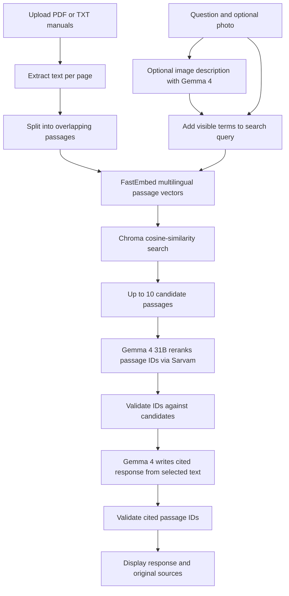

# Architecture and Retrieval Logic

## Overview

The troubleshooter accepts text-based PDF or TXT bike manuals, retrieves passages related to the user's symptom, and asks the model to rephrase supported information with source citations. The original manual passages remain visible alongside the response.

## Embeddings and Vector Database

- **Embedding model:** `sentence-transformers/paraphrase-multilingual-MiniLM-L12-v2`, executed locally through FastEmbed. It produces 384-dimensional multilingual sentence embeddings; passage and query vectors use the same model.
- **Vector database:** ChromaDB with an ephemeral in-memory client. The per-session collection is rebuilt when the uploaded passages change and is not persisted to disk.
- **Similarity search:** Chroma HNSW configured with cosine distance. `search_vector_index()` returns the closest passages up to a fixed maximum distance (`0.72`), with at most 10 candidates. No network embedding API is used.

## Manual Ingestion

`extract_manual()` in [manual_agent.py](manual_agent.py) handles uploaded files:

1. PDFs are read with `pypdf`, extracting selectable text page by page.
2. TXT files are decoded as UTF-8, with form-feed characters treated as page breaks.
3. Each page is split into chunks of up to 180 words with 35 words of overlap (a 145-word stride).
4. Every chunk receives an ID, its source filename, and a page reference.

Scanned PDFs without a text layer are not OCR'd and therefore produce no searchable passages.

## Semantic Retrieval

After `extract_manual()` creates page-referenced chunks, `create_vector_index()` embeds each passage and adds the vectors, original text, and source references to a Chroma collection. The app fingerprints the extracted passages and keeps the client and collection in Streamlit session state, so normal reruns do not re-embed an unchanged upload.

For each user query, `search_vector_index()` embeds the query with the same FastEmbed model and asks Chroma for the nearest passages using cosine distance. Results farther than `0.72` cosine distance are discarded; the remaining passages are returned in nearest-first order, capped at 10.

The threshold is a practical relevance guard, not a guarantee of relevance. It may need tuning against real manuals and questions. Embeddings can match related wording even when the query and manual do not share exact words.

## Sarvam Reranking

When `SARVAM_API_KEY` is configured, `rerank_passages()` sends the question and vector-search candidates to Sarvam's `/v2/chat/completions` endpoint with model ID `gemma4` (Gemma 4 31B). It asks the model only to return relevant candidate passage IDs in JSON, up to five IDs. `answer_from_manual()` then makes a separate call with only those selected passages and asks Gemma 4 to produce a concise paraphrase plus the IDs of the passages that support it.

`parse_selected_ids()` drops malformed, duplicate, or unknown IDs for both ranking and answer citations. `parse_manual_answer()` rejects answers with missing text or no valid citation IDs. The UI displays an accepted paraphrase with source references and keeps the exact extracted source passages available below it. If the API call fails or the response has no accepted citations, no generated answer is shown; only the selected source text remains.

The 30B Sarvam model is deprecated and unavailable through the current API, so this implementation uses the currently supported, similarly sized Gemma 4 31B model served through Sarvam. Gemma 4 access may require Sarvam v2 beta entitlement.

## Optional Photo Input

`describe_image_for_search()` uses Pillow to correct image orientation, resize to at most 1200 by 1200 pixels, and encode the image as JPEG. The image and a request for visible details are sent to Gemma 4 using inline base64 image input. The returned description is appended to the search query only; it is not shown as a diagnosis or answer. If image analysis fails, retrieval continues from the typed question.

## Grounding and Abstention

- If no vector result is within the cosine-distance threshold, the app reports that no sufficiently similar manual section was found and does not call the reranker.
- The reranker can select only IDs from the supplied candidate list; the application validates every selected ID before use.
- Generated responses are instructed to use only selected manual text and are displayed only when they include at least one valid selected passage ID.
- Exact extracted source passages remain visible alongside the response for verification.
- Without an API key, local lexical search still works; Sarvam reranking and photo-assisted search do not.

Citation validation ensures that cited IDs exist, but it cannot prove that every generated sentence is entailed by its citations. The answer model is instructed to stay within the excerpts; users can verify its paraphrase against the displayed source passages. The embedding model and distance threshold also affect retrieval quality and should be validated on the intended manual set.

## Main Files

- [app.py](app.py): Streamlit interface, uploads, retrieval workflow, cited answer, and source display.
- [manual_agent.py](manual_agent.py): extraction, chunking, Chroma vector indexing/search, Sarvam reranking and answer generation, and passage-ID validation.
- [tests/test_manual_agent.py](tests/test_manual_agent.py): checks vector result mapping and rejects unrecognized model-selected IDs.
- `.env`: local API credential loaded by `python-dotenv`; keep it private and do not commit it.